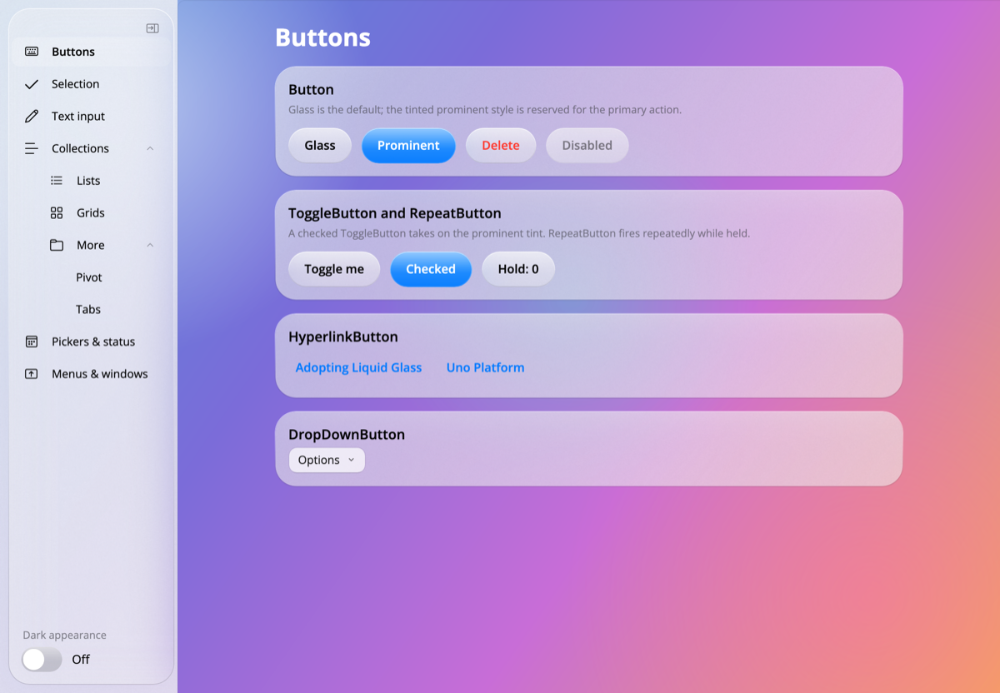

# Liquid Glass for Uno Platform

A reusable **Liquid Glass** theme for Uno Platform — Apple's [Liquid Glass design language](https://developer.apple.com/documentation/technologyoverviews/adopting-liquid-glass)
implemented the way [Uno.Themes](https://github.com/unoplatform/Uno.Themes) implements Material —
plus a gallery app (macOS + iOS) showing every standard control restyled with it.

| Project | What it is |
| --- | --- |
| `Uno.Themes.LiquidGlass` | The reusable theme library. Reference it from any Uno app. |
| `LiquidGlassGallery` | Control gallery app targeting `net10.0-desktop` (macOS/Windows/Linux) and `net10.0-ios`. |
| `LiquidGlassGallery.Tests` | NUnit tests validating the theme's dictionaries and design invariants. |



## Using the theme in your own app

Reference the library, then merge `LiquidGlassTheme` in `App.xaml` — the exact pattern
Uno.Themes uses for `MaterialTheme`:

```xml
<Application.Resources>
  <ResourceDictionary>
    <ResourceDictionary.MergedDictionaries>
      <XamlControlsResources xmlns="using:Microsoft.UI.Xaml.Controls" />
      <LiquidGlassTheme xmlns="using:Uno.Themes.LiquidGlass" />
    </ResourceDictionary.MergedDictionaries>
  </ResourceDictionary>
</Application.Resources>
```

All controls pick up Liquid Glass implicitly. Opt-in variants use explicit styles:

```xml
<Button Content="Buy"    Style="{StaticResource LiquidGlassProminentButtonStyle}" />
<Button Content="Delete" Style="{StaticResource LiquidGlassDestructiveButtonStyle}" />
<Border Style="{StaticResource LiquidGlassCardBorderStyle}">…</Border>
```

Rebrand without forking (mirrors `MaterialTheme.ColorOverrideSource`):

```xml
<LiquidGlassTheme xmlns="using:Uno.Themes.LiquidGlass"
                  ColorOverrideSource="ms-appx:///MyApp/Styles/LiquidGlassColorsOverride.xaml" />
```

Every standard control is covered, including fully retemplated segmented glass
DatePicker/TimePicker fields and an AutoSuggestBox with a glass field, query button,
and glass suggestions surface. See
[Uno.Themes.LiquidGlass/README.md](Uno.Themes.LiquidGlass/README.md) for the design
tokens, style catalog, and how the Liquid Glass rules are encoded.

## Running the gallery

```bash
# macOS (Skia desktop)
cd LiquidGlassGallery
dotnet run -f net10.0-desktop

# iOS simulator (requires full Xcode installed and selected)
dotnet build -f net10.0-ios -t:Run -p:RuntimeIdentifier=iossimulator-arm64
```

The sidebar's **Dark appearance** switch flips the whole app between the light and dark
glass palettes at runtime.

### Screenshot automation

The gallery can drive itself for visual verification: it walks every page in light and
dark theme, saves a bitmap of each, and exits.

```bash
LG_SCREENSHOT_DIR=/tmp/lg-shots dotnet run -f net10.0-desktop
```

## Tests

```bash
cd LiquidGlassGallery.Tests
dotnet test
```

The tests parse the theme's XAML from source and enforce, among other things:

- light/dark theme dictionaries define **identical key sets**
- glass fills are **AcrylicBrush** materials with translucent tints *and* translucent fallbacks
- the specular highlight **fades to fully transparent** (light hitting the top of the glass)
- buttons are **capsules** (corner radius = half the 44pt minimum touch target)
- the palette matches Apple system colors (`#007AFF`/`#0A84FF` blue, `#34C759`/`#30D158` green)
- every implicit style is based on a public `LiquidGlass*` explicit style
